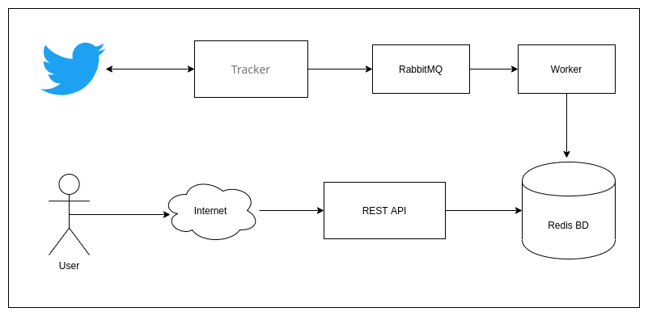

# Backend Exercise

## OVERVIEW

The application listen to tweets and track certain keywords and those tweets will be available through an API.

## GOALS

Listen to tweets and identify the required keywords
Make an API REST with the tweets.

## SPECIFICATIONS

The keywords we’re going to listen to, are: platzi, open source and node Twitter API (https://developer.twitter.com/en/docs/tweets/filter-realtime/overview) 
In case of a keyword match, the tweet will be sent to a RabbitMQ queue, which will be processed and saved to Redis. We will also have a REST API exposing the tweets we have saved.


## HOW IT WORKS

The aplication has 5 container to make an scalable infrastructure and there works in that way 



## Getting Started


### Prerequisites

You need to install docker and docker-compose, you can get information about the instalation in:

```
https://docs.docker.com/get-docker/
```

#### Environment Variables

```
NODE_ENV=development | production
API_KEY_TWITTER
API_SECRET_KEY_TWITTER
ACCESS_TOKEN_TWITTER
ACCESS_TOKEN_SECRET_TWITTER
STREAM_URL=statuses/filter
KEYWORDS=node,platzi,open source
RABBITMQ_SERVER=rabbitmq
RABBITMQ_USER
RABBITMQ_PWD
RABBITMQ_QUEUE=twitter_queue
REDIS_SERVER=redis
```

### Installing

To install the project in your server/machine you need tu build the docker-containers with the command:

```
docker-compose build
```

after you can start the services with the command:

```
docker-compose up
```

you can test if the system its running open the api endpont.

```
http://<your ip>/api/
```


## Built With
* [docker](https://docs.docker.com/) - Virtualization technology

* [rabbitMQ](https://www.rabbitmq.com/documentation.html) - Message broker
* [redis](https://redis.io/documentation) - Open source, in-memory data structure store, used as a database
* [node](https://nodejs.org/es/docs/) - JavaScript runtime

## Contributing

Please read [CONTRIBUTING.md](https://gist.github.com/PurpleBooth/b24679402957c63ec426) for details on our code of conduct, and the process for submitting pull requests to us.

## Author

* **Luis Antonio Rodriguez Garcia** - [luisrdz5](https://github.com/luisrdz5)


## License

This project is licensed under the MIT License - see the [LICENSE.md](LICENSE.md) file for details


